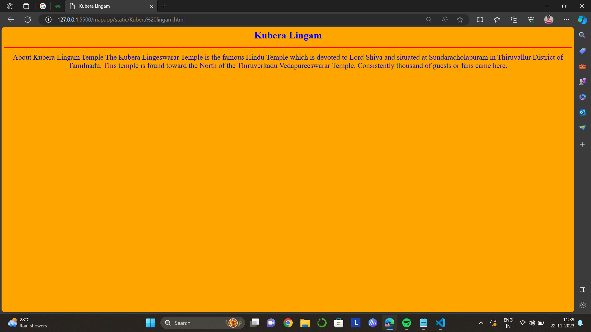

# Ex04 Places Around Me
## Date:22/11/23

## AIM
To develop a website to display details about the places around my house.

## DESIGN STEPS
### STEP 1
Create a Django-admin Interface.

### STEP 2
Download your city map from Google.

### STEP 3
Using <map> tag name the map.

### STEP 4
Create clickable regions in the image using <area> tag.

### STEP 5
Write HTML programs for all the regions identified.

### STEP 6
Execute the programs and publish them.

## PROGRAM
```
map.html
<html>
<head>	`
<title>My City</title>
</head>
<body>
<h1 align="center">
<font color="red"><b>Tiruvannamalai</b></font>
</h1>
<h3 align="center">
<font color="blue"><b>Ragavan(23013327)</b></font>
</h3>
<center>

<map name="MyCity">
<area shape="rect" coords="900,350,1000,450" href="home.html" title="My home town">
<area shape="rect" coords="850,450,970,500" href="college.html" title="Shanmuga Industries Arts & Science College">
<area shape="rect" coords="57,220,110,270" href="E sevai maiyam.html" title="E sevai maiyam">
<area shape="rect" coords="750,180,820,250" href="Resort.html" title="Naraiyani Resort">
<area shape="rect" coords="850,150,920,300" href="Kubera lingam.html" title="Kubera Lingam">
</map>
</center>
</body>
</html>

home.html

<html>
<head>
<title>Myhometown</title>
</head>
<body bgcolor="yellow">
<h1 align="center">
<font color="red><b>tiruvannamalai</b></font>
</h1>
<h3 align="center">
<font color="blue"><b>tiruvannamalai</b></font>
</h3>
<hr size="3" color="red">
<p align="center">
<font face="Gergia" size="5">
Arunachala Hill, also known as Arunachalam or Annamalai, is a sacred mountain in the town of Tiruvannamalai in the Indian state of Tamil Nadu. It is a significant pilgrimage site and holds immense spiritual and cultural importance, particularly in the Shaiva tradition of Hinduism. The name "Arunachala" is derived from the words "Aruna," meaning red or radiant, and "Achala," meaning hill. Thus, Arunachala is often referred to as the "Red Mountain" or the "Hill of Wisdom."The main attraction on Arunachala Hill is the ancient Arunachaleswarar Temple, dedicated to Lord Shiva. This temple is one of the Pancha Bhoota Sthalas, representing the element of fire (Agni). The Annamalaiyar Temple is a sprawling complex with towering gopurams (entrance towers), halls, and shrines. Pilgrims and devotees circumambulate the base of the hill, a practice known as Girivalam, as an act of devotion and to receive the blessings of Lord Shiva.Arunachala Hill is closely associated with the great sage Ramana Maharshi, who lived at the foot of the hill in the town of Tiruvannamalai. Ramana Maharshi's teachings emphasized self-inquiry and the quest for self-realization. He considered Arunachala as a manifestation of the divine and often spoke of the hill as a powerful means for attaining spiritual awakening.The sacred nature of Arunachala is also highlighted in ancient Hindu scriptures, including the Puranas and the Tamil literary work, "Tiruvannamalai Puranam." Legend has it that the hill is the physical form of Lord Shiva, who manifested as a towering column of fire to settle a dispute between Brahma and Vishnu about their supremacy.
Arunachala Hill is not just a physical landmark but is considered a living spiritual presence. The very sight of the hill is believed to have the power to cleanse the mind and aid in spiritual transformation. Many spiritual seekers and devotees visit Tiruvannamalai to experience the divine energy associated with Arunachala.
Apart from the religious and spiritual significance, Arunachala Hill is set amidst picturesque surroundings, making it a serene and tranquil location. The hill is also a popular trekking destination, attracting adventure enthusiasts who seek a blend of spirituality and natural beauty.In conclusion, Arunachala Hill stands as a symbol of divinity, drawing devotees, seekers, and nature lovers alike. Its rich history, association with spiritual luminaries, and the sacred ambiance make it a unique and revered destination in the spiritual landscape of India.
</p>
</body>
</html>

Kubera Lingam.html

<html>
<head>
<title>Kubera Lingam</title>
</head>
<body bgcolor="orange">
<h1 align="center">
<font color="red><b>tiruvannamalai</b></font>
</h1>
<h3 align="center">
<font color="blue"><b>Kubera Lingam</b></font>
</h3>
<hr size="3" color="red">
<p align="center">
<font face="Gergia" size="5">
About Kubera Lingam Temple
The Kubera Lingeswarar Temple is the famous Hindu Temple which is devoted to Lord Shiva and situated at Sundaracholapuram in Thiruvallur District of Tamilnadu. This temple is found toward the North of the Thiruverkadu Vedapureeswarar Temple. Consistently thousand of guests or fans came here.
</p>
</body>
</html>

college.html

<html>
<head>
<title>Shanmuga Industries Arts & Science College</title>
</head>
<body bgcolor="red">
<h1 align="center">
<font color="red>
<b>tiruvannamalai</b>
</font>
</h1>
<h3 align="center">
<font color="blue"><b>Shanmuga Industries Arts & Science College
</b></font>
</h3>
<hr size="3" color="red">
<p align="center">
<font face="Gergia" size="5">
Shanmuga Industries Arts & Science College (SIASC) was established in 1996 by Shanmuga Industries Educational Trust, Tiruvannamalai[2]

Programs
Shanmuga Industries Arts and Science College offers a variety of courses aimed at educating students about engineering. Courses of study include:[3]

U.G. Courses:-

B.A., Tamil
B.A., English
B.Sc., Mathematics
B.Sc., Physics
B.Sc., Chemistry
B.Sc., Biochemistry
B.Sc., Biotechnology
B.Sc., Microbiology
B.Sc., Electronics Science
B.Sc., Computer Science
B.Sc., ISM (Information System Management)
B.C.A., (Computer Application)
B.Com., (General)
B.Com CA., (Computer Application)
B.Com FA., (Finance & Accounts)
B.Sc Bio-Technology
B.B.A., (Business Administration)
P.G Courses

M.A., Tamil
M.A., English
M.Sc., Mathematics
M.Sc., Physics
M.Sc., Chemistry
M.Sc., Microbiology
M.Sc., Computer Science
M.C.A., (Approved by AICTE)
M.Com
</p>
</body>
</html>

Resort.html
<html>
<head>
<title>Resort</title>
</head>
<body bgcolor="cyan">
<h1 align="center">
<font color="red><b>tiruvannamalai</b></font>
</h1>
<h3 align="center">
<font color="blue"><b>Naraiyani Resort</b></font>
</h3>
<hr size="3" color="red">
<p align="center">
<font face="Gergia" size="5">
Narayani Resort - Serene resort with private swimming pool is situated in Tiruvannāmalai and offers a garden and a shared lounge. This property offers access to a terrace, free private parking and free WiFi. The holiday home has an outdoor swimming pool, open-air bath and room service.
The air-conditioned holiday home is composed of 3 separate bedrooms, a living room, a fully equipped kitchen with kitchenware, and 3 bathrooms. A flat-screen TV is offered. Housekeeping service is also available.
The nearest airport is Puducherry Airport, 109 km from the holiday home.
</p>
</body>
</html>

E sevai maiyam.html
<html>
<head>
<title>E sevai maiyam</title>
</head>
<body bgcolor="green">
<h1 align="center">
<font color="red><b>tiruvannamalai</b></font>
</h1>
<h3 align="center">
<font color="blue"><b>E sevai maiyam</b></font>
</h3>
<hr size="3" color="red">
<p align="center">
<font face="Gergia" size="5">
The aim of this initiative is to establish at least one e-Sevai centre in every village and a ward in Tamil Nadu. The objective is to increase the number of centres across the state by taking e-services to the remotest corners of Tamil Nadu while simultaneously making this a viable entrepreneurship opportunity for citizens.

</p>
</body>
</html>


```

## OUTPUT





## RESULT
The program for implementing image maps using HTML is executed successfully